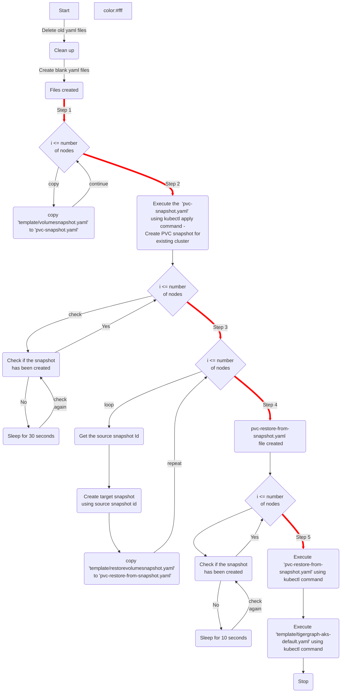

# TigerGraph - Clone cluster

This would be useful for users who want to clone the **TigerGraph** cluster running on Azure Kubernetes Service and would spin up look alike cluster along with the data. This would typically be required for teams who want to spin up cluster for few hours, perform some analytics and then tear down the cluster. 

# Sources

The source folder has script file and template folder that has yaml files. On execution of the **copysnapshot.sh** file, it would basically expect some parameters and would take snapshot of PVC of existing cluster and create new cluster and restore the PVC on the new cluster.  

## Execution

```
usage: ./copysnapshot.sh 
	<source-subscription id>
	<source-subscription resourcegroup>
	<target-subscription id>
	<target-subscription resourcegroup>
	<source-aks-instance-name>
	<number-of-nodes-in-existing-tigergraph-cluster>
```


## Execution Flow 





```